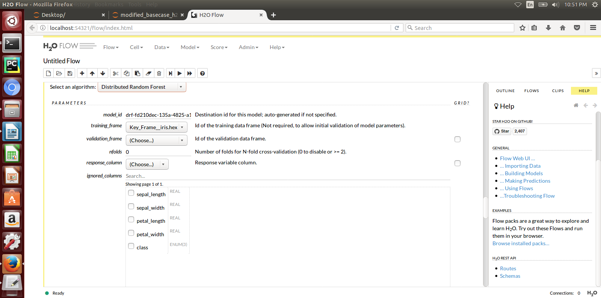

# Acumos Tools for H2o and Generic Java 

### Tools = Onboarding client library + Model runner

 They provide a way to use H2o.ai and Generic Java in the Acumos Platform. 


----------
### Onboarding client Library (git clone https://gerrit.acumos.org/r/acumos-java-client):
----------
 Allows the H2o or Generic Java model and other artifacts to become avaiable in the onbarding server for the H2o Model runner to be able use them

- The Modeller/Onboarder/ ML expert creates his model in H2o and exports it in the MOJO model format (.zip file) using any interface (eg.Python, Flow, R) provided by H2o
- For Generic Java, the Modeller/Onboarder/ ML expert creates his model and exports it in the .jar format.
- He runs the JavaClient jar, which (TODO: creates a Protobuf file for the Model), creates the required metadata.json file and onboards the model onto the onboarding server.

----------
### Model Runner (git clone https://gerrit.acumos.org/r/generic-model-runner):
----------
 Allows the onboarded Model to be run as containerised microservice and allows other external applications to use the onboarded Model for predictions.

- Essentially, provides a wrapper around the ML model, packages it as a containerised microservice and exposes a transform/predict method as a rest endpoint.
- This method can be called by other external applications to request predictions off of the model.

----------
### 1. How to get them:
----------

#### For the Modeller/Onboarder/ ML expert:

You will need the following zips / jars from the above 2 projects:
Create a runnable client jar from below project:
https://gerrit.acumos.org/r/acumos-java-client

If you are using H2o, you will need H2OModelService.jar.
To get the model service jar file build the below project code
https://gerrit.acumos.org/r/generic-model-runner

If you are using Generic Java, you will need GenericModelService.
To get the model service jar file build the below project code
https://gerrit.acumos.org/r/generic-model-runner

#### For the Developer:

To clone the client library (https://gerrit.acumos.org/r/acumos-java-client) project:
```
git clone https://gerrit.acumos.org/r/acumos-java-client
```

To run the client project,you will need the following installed on your machine.
- Java (jdk) 1.8
- Protoc compiler 3.4.0
- Maven
- Protobuf Java runtime 3.4.0

To build the project, you can use:
```
mvn clean install
```


To clone the model runner (https://gerrit.acumos.org/r/generic-model-runne) project:
```
git clone https://gerrit.acumos.org/r/generic-model-runner
```
To build the model runner project, refer to instructions on https://gerrit.acumos.org/r/generic-model-runner.


----------
### 2. Required Installations:
----------

You must have the following installed on your machine-

#### For the Modeller/Onboarder/ ML expert:
- Java 1.8


----------
### 3. Preparing to Onboard your Model:
----------

a. Place JavaClient.jar, and H2OModelService.jar or GenericModelService.jar in one folder locally.

b. Additionally place your models in a separate folder. In case of H2o your model will be a MOJO zip file. In case of Generic Java, your model will be .jar file. We have included sample models for you to play around with.
Find a sample H2o model mode_e911.zip in the /h2o_distributable folder.
Find a sample Generic Java model KnnModel.jar in the /generic_distributable folder.

c. Currently, we require the modeller to also create a default.proto file for the model in the following format. He needs to appropriately replace the data and datatypes under DataFrameRow according to his model. (This will not be needed to be done in the future as we will autogenerate .proto files.)

```
syntax = "proto3";
option java_package = "com.google.protobuf";
option java_outer_classname = "DatasetProto";

message DataFrameRow {
string sepal_len = 1;
string sepal_wid = 2;
string petal_len = 3;
string petal_wid = 4;
}
message DataFrame {
 	repeated DataFrameRow rows = 1;
}
message Prediction {
	repeated string prediction= 1;
}

service Model {
  rpc transform (DataFrame) returns (Prediction);
}
```
d. Place the created default.proto file in the same folder where your models are. (Note: Not the folder where your JavaClient.jar and other model service jars are.)


----------
### 4. Onboarding your model
----------

JavaClient.jar is the executable client jar file.

The parameters to run the client jar are: 

1. Onboarding url / Folder path
2. Model Type - either H for H2o or G for Generic Java 
3. Folder path having default.proto and your model
4. Name of the model (This must match the name of your model file. Exclude the file extension)


For example, if you want to onboard a H2o model called Resource_utilization_predictor.zip which you have placed under D:\User\Desktop\model_folder, you would use the following command-

```
java -jar JavaClient.jar <ServerUrl> H <PathOfSupportingFolder> <modelname> <username> <password> 
```

For example, if you want to onboard a Generic Java model called Customer_churn_predictor.jar which you have placed under C:\User\mymodels, you would use the following command-

```
java -jar JavaClient.jar <ServerUrl> G <PathOfSupportingFolder> <modelname> <username> <password>
```


There are two ways a modeler can onboard a model:

1. Throught the Java client - Described above.
2. Through Web based onboarding - This is another way to onboard the model. For this rather than passing the Onboarding url in first parameter, pass a folder path where you are expecting a model dump file.
this way client will create a modeldump.zip in the folder path and you can login to portal market place and onboard the model through it.


----------
### 5. What happens after onboarding?
----------
- You will be able to get a success message if your model was onboarded successfully.
- You and your teammates can now see, collaborate on your model in the Acumos marketplace.
- When requested by a user, your model runs as a containerised microservice and exposes a transform/predict method as a rest endpoint.
- This method can be called by other external applications to request predictions off of your model.


----------
### Addendum : Creating a model in H2o:
----------
You must have H2o 3.14.0.2 installed on your machine. For instructions on how to install visit https://www.h2o.ai/download/

H2o provides different interfaces to create models and use H2o for eg. Python, Flow GUI, R, etc.
As an example, below we show how to create a model using the Python innterface of H2o and also using the H2o Flow GUI. You can use the other interfaces too which have comparable functions to train a model and download the model in a MOJO format.


#### Here is a sample H2o iris example program that shows how a model can be created and downloaded as a MOJO using the Python Interface 
  
  
```python
import h2o
import pandas as pd
import numpy as np
import matplotlib.pyplot as plt
import seaborn as sns

# for jupyter notebook plotting,
%matplotlib inline
sns.set_context("notebook")

h2o.init()

# Load data from CSV
iris = h2o.import_file('https://raw.githubusercontent.com/h2oai/h2o-3/master/h2o-r/h2o-package/inst/extdata/iris_wheader.csv')

Iris data set description
-------------------------
1. sepal length in cm
2. sepal width in cm
3. petal length in cm
4. petal width in cm
5. class:
    Iris Setosa
    Iris Versicolour
    Iris Virginica


iris.head()
iris.describe()
# training parameters
training_columns = ['sepal_len', 'sepal_wid', 'petal_len', 'petal_wid']
#  response parameter
response_column = 'class'

# Split data into train and testing
train, test = iris.split_frame(ratios=[0.8])
train.describe()
test.describe()

from h2o.estimators import H2ORandomForestEstimator
model = H2ORandomForestEstimator(ntrees=50, max_depth=20, nfolds=10)

# Train model
model.train(x=training_columns, y=response_column, training_frame=train)

print (model)

# Model performance
performance = model.model_performance(test_data=test)
print (performance)

# Download the model in MOJO format. Also download the h2o-genmodel.jar file
modelfile = model.download_mojo(path="/home/deven/Desktop/", get_genmodel_jar=True)

predictions=model.predict(test)
predictions
``` 

#### Here is a sample H2o iris example program that shows how a model can be created and downloaded as a MOJO using the H2o Flow GUI.
 
 
 
 
 
 

----------
### Any other info you might want to include
---------- 
Examples:
How was the Generic Java model created?

Tutorials:
